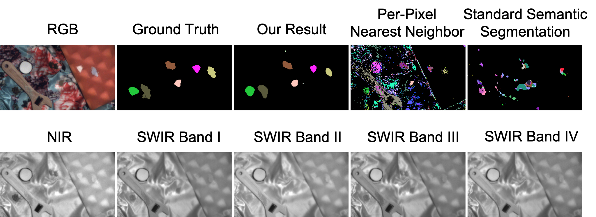

# Multispectral Imaging for Fine-Grained Recognition of Powders on Complex Backgrounds

[Tiancheng Zhi](http://cs.cmu.edu/~tzhi), [Bernardo R. Pires](http://www.andrew.cmu.edu/user/bpires/), [Martial Hebert](http://www.cs.cmu.edu/~hebert/), [Srinivasa G. Narasimhan](http://www.cs.cmu.edu/~srinivas/)

IEEE Conference on Computer Vision and Pattern Recognition (CVPR), 2019. 

[[Project](http://www.cs.cmu.edu/~ILIM/projects/IM/MSPowder/)] [[Paper](http://www.cs.cmu.edu/~ILIM/projects/IM/MSPowder/files/ZPHN-CVPR19.pdf)] [[Supp](http://www.cs.cmu.edu/~ILIM/projects/IM/MSPowder/files/ZPHN-CVPR19-supp.pdf)]

<p align="center">

</p>

## Requirements
- NVIDIA TITAN Xp
- Ubuntu 16.04
- Python 3.6
- OpenCV 4.0
- PyTorch 1.0
- Visdom

## Download "SWIRPowder" Dataset
Download the ["data" folder](https://drive.google.com/open?id=1TmWwUSHIMpDdJlNjFu57aTkkD9r_Wxah), untar all subfolders, and put it in the repo root directory.
See "data/readme.txt" for description.

## Calibarate Attenuation Parameter
In "prepare" directory, run:
```
python calibrate_kappa.py
```

## Band Selection
See "readme.txt" in "bandsel" directory

## Recognition with Known Powder Location/Mask
In "recog" directory, run:
```
python recognition.py
```

## Recognition without Known Powder Location/Mask
### Prepare real data
In "prepare" directory, run:
```
sh create_real_hdf5.sh
```

### Prepare synthetic data
Download the ["synthetic" folder](https://drive.google.com/drive/folders/16hx4j6FwEkDSjTljxedNnKA6-F8SV6SZ?usp=sharing) and put it in the repo root directory.

### Train on synthetic powder on synthetic background
In "src" directory, run:
```
python train.py --out-path ckpts/ckpt_default --bands 0,1,2,3,77,401,750,879
```

Note that the hdf5 file merges RGBN and SWIR channels, so channel ID 0\~3 are RGBN channels, channel ID 4\~964 are SWIR channels.

To use NNCV selection, use `--bands 0,1,2,3,77,401,750,879`.

To use Grid selection, use `--bands 0,1,2,3,4,34,934,964`.

To use MVPCA selection, use `--bands 0,1,2,3,127,152,686,837`.

To use RS selection, use `--bands 0,1,2,3,4,422,588,905`.

See "bandsel/bands/" for more selected bands. Remember to "add 4" to convert 0\~960 range to 4\~964 range.


### Train on synthetic powder on real background
In "src" directory, run:
```
python finetune.py --out-path ckpts/ckpt_default_extft --bands 0,1,2,3,77,401,750,879 --pretrain ckpts/ckpt_default/247.pth --split bgext
```

Note: use `--split bg` for experiments on unextended dataset.

### Train on real powder on real background
In "src" directory, run:
```
python finetune_real.py --out-path ckpts/ckpt_default_extft_real --bands 0,1,2,3,77,401,750,879 --pretrain ckpts/ckpt_default_extft/55.pth
```

### Test with CRF post-processing
In "src" directory, run:
```
python test.py --ckpt model.pth          # Test on Scene-test
python test_merge.py --ckpt model.pth    # Test on dataset merging Scene-test and Scene-sl-test
```

### Pretrained model
Download [pretrained.pth](https://drive.google.com/file/d/1RcNNbFX2CG63FaSZWzsLBzPW31w4pmj6/view?usp=sharing), put it in "src" directory, and test it with:
```
python test_merge.py --ckpt pretrained.pth
```
